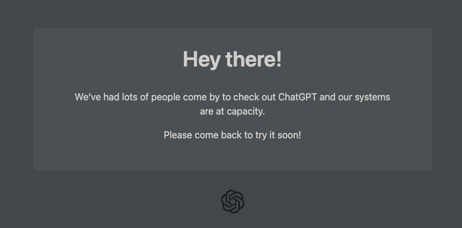
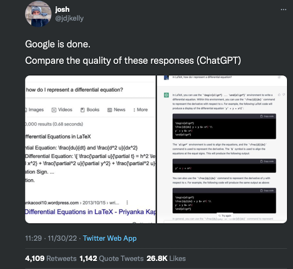
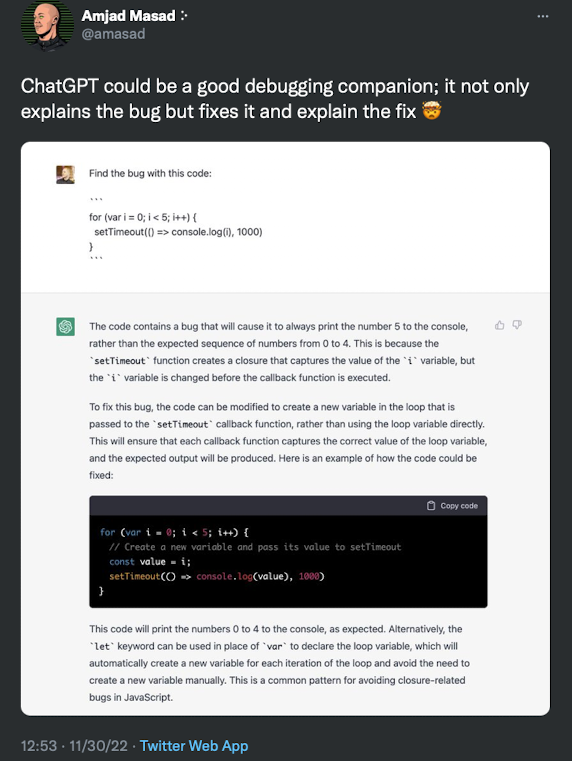
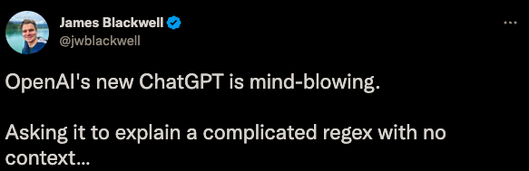
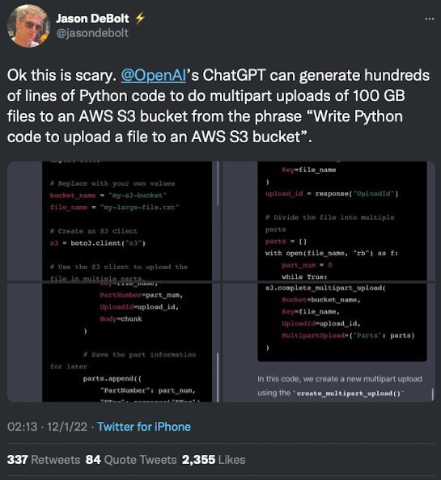
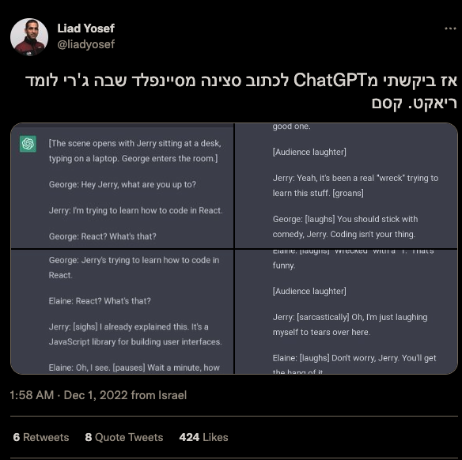
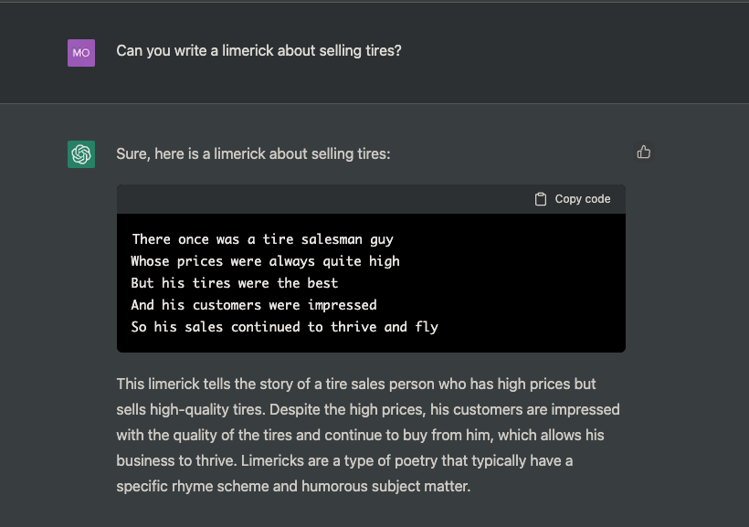
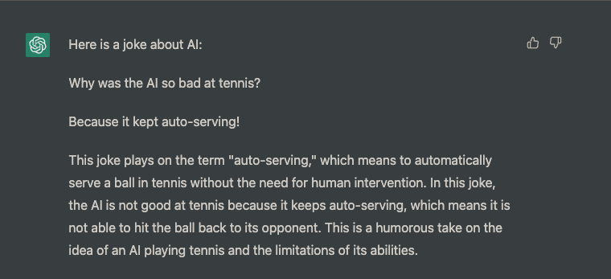

# ChatGPT

Hello,

It appears that yesterday, 30 Nov 2022, one of the major research outfits in AI, creator of [GPT](https://en.wikipedia.org/wiki/OpenAI#Generative_models) and the text-to-image model, [DALL-E,](https://en.wikipedia.org/wiki/DALL-E) just dropped a new product, [ChatGPT](https://openai.com/blog/../assets/2022-12-01-chatgpt/).

This product appears to be a disrupter in the way we will query the internet, seek information, and probably even how we code. It is early, but from what I have read thus far, ChatGPT will be a game changer across the various disciplines of technology and beyond.

I have not had a chance to use ChatGPT because there has been so much traffic to the site today and OpenAI are limiting users.

OpenAI site when attempting access ChatGPT at 09:47 (01 Dec 2022)

Nonetheless, I feel that ChatGPT is so important that I needed to share what I have seen so far from postings online.

## UPDATE: I got access

While drafting this doc, I was permitted access to ChatGPT. So, I sprinkled in some of my own examples as well.

## Internet Queries

> NOTE: Click on the images below to enlarge text

The following thread shows numerous side-by-side examples on how ChatGPT may overtake Google in the market for informational queries

Tweet by: Josh Kelly comparing ChatGPT with Google

Full tweet [here](https://twitter.com/jdjkelly/status/1598021488795586561?s=61&t=iqoKlIg9UdCDiFViE6iH_w)

&nbsp;

You can see from the examples, that Google tends to provide several options to obtain an answer, whereas ChatGPT provides one answer with context.

## Applications for Code Development

> NOTE: Tap the arrows to reveal the content

### Debugging

Tweet by: Amjad Masad showing how ChatGPT debugs code

Full tweet [here](https://twitter.com/amasad/status/1598042665375105024?s=20&t=40Z9FJADyyDw2hzCaphSKA)

&nbsp;

The example above shows an individual purposefully writing an incorrect loop and asking ChatGPT to not only debug the code but provide an explanation for the error and solution. I am not a Java expert, but ChatGPT performs well and provides a solution with a rich explanation.

### Code Explanation

Tweet by: James Blackwell on explaining `regex`

Full tweet [here](https://twitter.com/jwblackwell/status/1598090447854792705?s=61&t=iqoKlIg9UdCDiFViE6iH_w)

&nbsp;
&nbsp;

### Draft Code from Scratch

Tweet by: Jason Debolt on explaining how to draft code from scratch with ChatGPT

Full tweet [here](https://twitter.com/jasondebolt/status/1598243854343606273?s=61&t=iqoKlIg9UdCDiFViE6iH_w)

&nbsp;
&nbsp;

## Other Uses for ChatGPT

### Rewriting a Script

Below, a user asks ChatGPT to rewrite a Seinfeld scene, where Jerry has to learn to code in React

Tweet by: Liad Yosef on asking ChatGPT to write a Seinfield scene

_originally written in Hebrew_

Full tweet [here](https://twitter.com/liadyosef/status/1598240194892890112?s=61&t=iqoKlIg9UdCDiFViE6iH_w)

&nbsp;
&nbsp;

### Poetry/Creative Writing

Here is a limerick I asked ChatGPT to write. I wanted the subject to be about selling tires

### Write a joke

## Potential Limitations

Now that you have seen several examples of how ChatGPT can be used, here some potential limitations:

1. Does not provide citations or references in its responses
2. Although safeguards are in place, toxic responses can be provided by the product
3. Provides verbose responses
4. Repeats phrases across different prompts
5. Lacks the ability to ask clarifying questions
6. When wrong, it can be confidently wrong

## Try it for Yourself

You can try ChatGPT for free by navigating to [chat.openai.com/chat](http://chat.openai.com/chat), creating and verifying your account, and plugging away.

Hopefully this was helpful, please reach out with feedback or comments on Teams

Moyo

_Originally authored December 2022_
